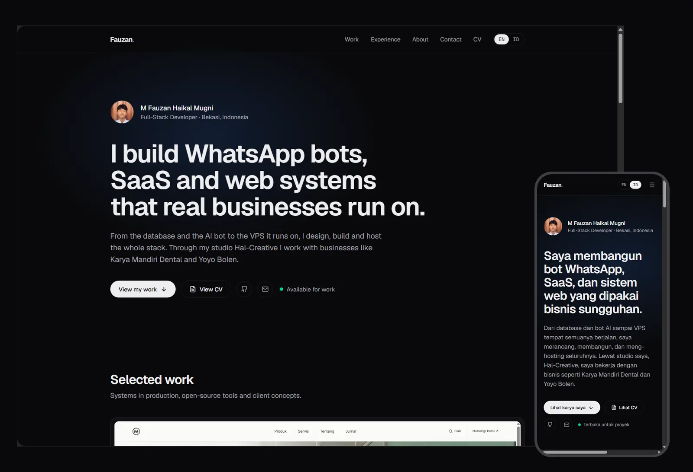
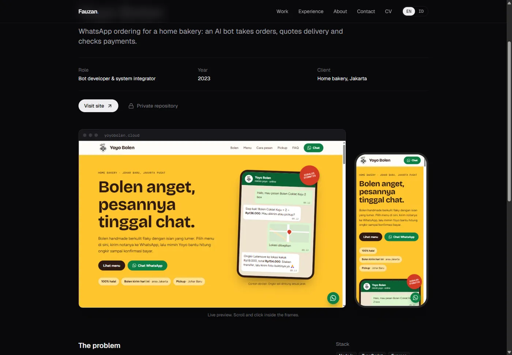
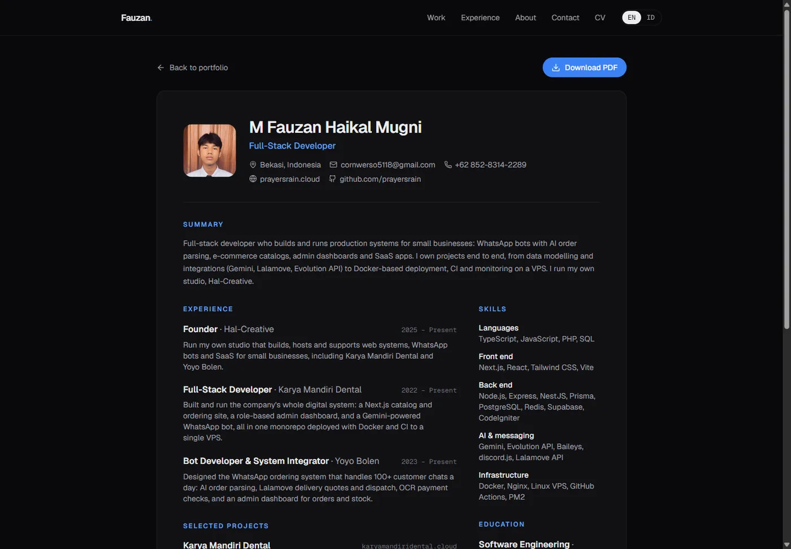

<div align="center">

# Fauzan · Portfolio

Bilingual (English / Indonesian) portfolio of a full-stack developer who builds WhatsApp bots, SaaS and web systems for real businesses.

**[prayersrain.cloud](https://prayersrain.cloud)** · [Bahasa Indonesia](https://prayersrain.cloud/id) · [CV](https://prayersrain.cloud/cv)



</div>

## Highlights

- **Case studies with live previews.** Each project page embeds the real site in laptop and phone frames, rendered at its true viewport size and scaled to fit.
- **Two languages, one source.** Every piece of text is an `{ en, id }` pair. English lives at `/`, Indonesian at `/id`, with hreflang alternates and a language switch that keeps you on the same page.
- **A CV that is also a PDF.** `/cv` is a web page that prints to a clean one-page A4, and `npm run cv:pdf` renders it to downloadable PDFs with headless Chrome.
- **Fully static.** `output: "export"` with no server at runtime. Scroll reveals use CSS view timelines instead of an animation library.

| Case study | CV |
| --- | --- |
|  |  |

## Featured work

| Project | What it is |
| --- | --- |
| [Karya Mandiri Dental](https://prayersrain.cloud/projects/karya-mandiri-dental) | Catalog site, admin dashboard and AI WhatsApp bot for a dental equipment supplier |
| [Yoyo Bolen](https://prayersrain.cloud/projects/yoyo-bolen) | WhatsApp ordering for a home bakery: AI order parsing, Lalamove delivery and OCR payment checks |
| [Viewport Studio](https://prayersrain.cloud/projects/viewport-studio) | Open-source Chrome extension to preview a site on several devices side by side |
| [Kapster.id](https://prayersrain.cloud/projects/kapster) | Operations SaaS for barbershops: booking, schedules, cashier and reports |
| [Lighthouse](https://prayersrain.cloud/projects/lighthouse) | Marketing site and direct-booking prototype for a boutique hotel |
| [Hal Support Bot](https://prayersrain.cloud/projects/hal-support-bot) | Discord helpdesk for Hal-Creative clients |

## Tech

Next.js 16 (App Router, static export) · React 19 · TypeScript · Tailwind CSS 4 · lucide-react

## Getting started

```bash
npm install
npm run dev      # http://localhost:3000
```

```bash
npm run build    # static site in out/
npm run cv:pdf   # after build: public/fauzan-cv-{en,id}.pdf
npm run lint
```

`cv:pdf` needs Chrome or Edge installed. Set `CHROME_PATH` if it isn't found.

## Project structure

```
src/
  app/(en)/     English routes at /
  app/id/       Indonesian routes under /id
  components/   Page and UI components
  data/         Profile, projects and experience content
  lib/          i18n helpers and page metadata
scripts/        CV PDF rendering and a fix for static exports built on Windows
public/         Images, project screenshots and the generated CV PDFs
```

## Editing content

- Profile, summary, skills and testimonial: `src/data/profile.ts`
- Projects and case studies: `src/data/projects.ts` (drives the home grid, case study pages, CV and sitemap)
- Experience and education: `src/data/experience.ts`
- Interface text: `src/lib/i18n.ts`

After changing anything that appears on the CV, run `npm run build && npm run cv:pdf` and commit the regenerated PDFs.

## License

© M Fauzan Haikal Mugni. The code is here to read and learn from. Personal content, photos and client project screenshots are not licensed for reuse.
